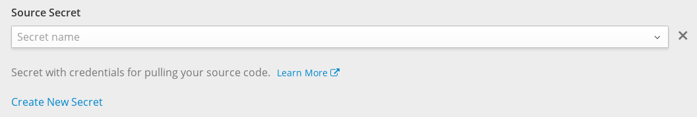

<!-- TOC depthFrom:1 depthTo:6 withLinks:1 updateOnSave:1 orderedList:0 -->

- [构建相关问题](#构建相关问题)
	- [容器云只支持github吗？](#容器云只支持github吗)
	- [只支持git仓库吗？我们团队使用的是svn，能够构建svn的代码吗？](#只支持git仓库吗我们团队使用的是svn能够构建svn的代码吗)
	- [我不想公开我构建的镜像，但是DockerHub私有仓库需要收费，我们是否有docker镜像库呢？](#我不想公开我构建的镜像但是dockerhub私有仓库需要收费我们是否有docker镜像库呢)
- [部署相关问题](#部署相关问题)
	- [只能通过构建代码来部署项目吗？我有镜像的话，可以直接部署吗？](#只能通过构建代码来部署项目吗我有镜像的话可以直接部署吗)
	- [为什么我点击旧版本的deployment的rollback之后，新的deployment并没有回退到之前的版本？](#为什么我点击旧版本的deployment的rollback之后新的deployment并没有回退到之前的版本)
- [一般问题](#一般问题)
	- [Service与Route有什么区别？](#service与route有什么区别)

<!-- /TOC -->

# 构建相关问题

## 容器云只支持github吗？

不是的。容器云支持任何git仓库，可以使用Github、BitBucket、Coding.net，只要是容器云能访问的git仓库就可以。或者使用你们团队的私有git仓库，如果私有的git仓库有拉取的身份认证，容器云支持使用pull secret来拉取，在准备构建镜像的时候，打开进阶选项，就能看得到。

## 只支持git仓库吗？我们团队使用的是svn，能够构建svn的代码吗？

很抱歉，目前暂时不支持svn仓库代码的构建。但是你可以直接编写一个dockerfile，构建好镜像以后，参照[部署镜像到项目](how-tos/deploy-image.md)的说明，直接部署构建好的镜像即可。或者参照[从源代码构建镜像](how-tos/source-to-image.md)，使用一个很方便的源代码到镜像的构建工具，进行镜像构建，然后部署。

## 我不想公开我构建的镜像，但是DockerHub私有仓库需要收费，我们是否有docker镜像库呢？

有的。平台有一个自己的镜像库，用于存放我们在平台使用或者构建的所有镜像。现在已经开放出来供大家使用了，详细请查看[使用云平台私有镜像库](how-tos/use-private-registry.md)。

# 部署相关问题

## 只能通过构建代码来部署项目吗？我有镜像的话，可以直接部署吗？

这个当然是可以的。构建代码只是帮助你构建一个镜像，然后自动部署。如果你自己已经有镜像的话，就可以直接部署镜像了。具体方法，请参照[部署镜像到项目](how-tos/deploy-image.md)这篇教程。

## 为什么我点击旧版本的deployment的rollback之后，新的deployment并没有回退到之前的版本？

可能与你没有设置构建的镜像标签有关。deployment部署指定标签的镜像，默认为latest。而每一次的构建，都会覆盖掉lastet，成为最新的镜像。如果需要保留不同的版本的镜像，就需要在每次构建的时候，设置镜像的标签。详细流程，请查看[构建不同版本的镜像](how-tos/build-and-tag-image.md)。

# 一般问题

## Service与Route有什么区别？

Service是最底层的开放服务的方式，实际上它开放了容器的某一个端口到外部，不受你所使用的通讯协议的限制。Service不指定域名，如果需要给Service设置域名，则需要我们自己在域名解析中，添加这个Service的公网IP的一条解析记录。

Route则是一个http、https和ws的代理，Route可以指定域名，Router绑定了容器云服务器的80和443端口，让用户能够直接在浏览器输入Route指定的网址以及协议，访问我们的服务。一个请求到达80或者443端口时，Router会根据HTTP报文的HOST请求头的域名，找到对应的Route，并将本请求转发给对应的Service。Route支持https，可以使用加密，具体查看Route中的Secure Route的相关设置。
