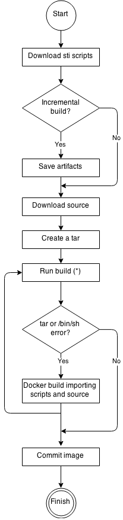

# 构建一个构建镜像

构建镜像，是一个比较特殊的镜像，s2i工具使用这个构建镜像，构建用户提供的代码，并生成最终能够在docker运行的应用程序镜像。

查看这个官方文档，可以了解更多：<https://github.com/openshift/source-to-image>

下面讲述如何构建一个构建镜像。

## 准备工作

### 需要的文件和目录

文件                     | 是否必须 | 描述
:--------------------- | :--- | :--------------------
Dockerfile             | 是    | 定义构建镜像的基底镜像
s2i/bin/assemble       | 是    | 用于构建应用程序的通用脚本
s2i/bin/usage          | 否    | 用于打印出如何使用本构建镜像的说明
s2i/bin/run            | 是    | 用于执行应用程序
s2i/bin/save-artifacts | 否    | 用于需要保存已经构建好的文件的持续构建过程
test/run               | 否    | 用于测试构建镜像是否无错误
test/test-app          | 否    | 用于测试应用程序的源代码

我们可以使用s2i提供的一个方便的命令，来创建这些文件，如下

```
s2i create <镜像名> <目标路径>
```

然后s2i工具会再目标路径下，创建好这些文件的样例，我们只需要修改那些文件成我们需要的样子即可。详细的信息可查看`s2i create --help`

### 构建过程解释

构建过程使用三个基本元素来构建最终的镜像，分别是：源代码、s2i脚本和构建镜像。构建过程中，s2i会把源打码放入构建镜像中，通过把源打码的脚本打包到一个tar文件并传入构建镜像来实现。在执行`assemble`脚本以前，s2i会解包刚才的tar文件到一个目录，该目录可以用`--destination`来指定，或者构建镜像中的名为`io.openshift.s2i.destination`的标签名，默认为`/tmp`。如果你的镜像没有`tar`或者`/bin/sh`这些程序，s2i会执行一次额外的构建，装好这些文件，然后才执行原先的构建。

如下图所示，图片来源：<https://github.com/openshift/source-to-image/blob/master/docs/sti-flow.png>



图中，`Run build`这一步骤解包了源代码、脚本、额外文件（可选的）并执行`assemble`脚本。如果前一次构建失败了，那么下一次构建不会复制，只会执行`assemble`脚本，因为那些文件已经存在了。

### Dockerfile

Dockerfile负责安装所有必须的工具和软件库，以构建和运行应用程序。这个文件也要**处理复制s2i脚本到创建的镜像的工作**。

### s2i脚本

所有的s2i脚本能用任意一种语言编写，只要能够在构建镜像内部运行即可。

#### assemble

负责从源代码构建应用程序组件并放置这些文件到镜像指定的文件夹。脚本的大致执行流程如下：

1. 如果需要持续构建，可以在这里定义恢复已构建好的文件的步骤，或者在`save-artifacts`文件里面定义。
2. 放置源代码到合适的位置
3. 构建应用程序的文件
4. 安装这些文件到运行程序所需的位置当中，如`/usr/bin`

如果你需要在构建时使用不同于Dokcerfile定义的Linux账户，你可以使用下面两个方法：

1. 在命令行中加入参数`--assemble-user`
2. 设置镜像标签`io.openshift.s2i.assemble-user`的值

样例：

```bash
#!/bin/bash

# 恢复先前的构建文件
if [ "$(ls /tmp/artifacts/ 2>/dev/null)" ]; then
    mv /tmp/artifacts/* $HOME/.
fi

# 移动应用源代码
mv /tmp/s2i/src $HOME/src

# 构建应用程序文件
pushd ${HOME}
make all

# 安装应用文件
make install
popd
```

#### run

运行应用程序时使用的脚本文件，也就是`docker run`时执行的脚本。示例如下

```bash
#!/bin/bash

# 执行应用程序
/opt/application/run.sh
```

#### save-artifacts

负责收集所有的依赖文件，并打包到一个tar文件中，然后输出到标准输出(stdout)中。这个过程能够加速后面的构建过程。注意，本脚本必须时输出tar文件的输出流，没有其他任何东西，这通过把输出重定向到`/dev/null`做到。如下所示

```bash
#!/bin/bash

pushd ${HOME} >/dev/null
if [ -d deps ]; then
    # all deps contents to tar stream
    tar cf - deps
fi
popd >/dev/null
```

#### usage

负责告诉用户，怎么使用你这个构建镜像。需要将说明输出到标准输出中。

```bash
#!/bin/bash

cat <<EOF
This is a S2I sample builder image, to use it, install
https://github.com/openshift/source-to-image
EOF
```

#### test/run

本脚本检查构建镜像是否没有错误。整个测试流程应该想下面这样

1. 构建构建镜像
2. 运行构建镜像，验证`usage`脚本无误
3. 运行`s2i build`验证`assemble`脚本无误
4. （可选）再次运行`s2i build`确定`save-artifacts`脚本无误
5. 运行应用镜像，确定测试应用正在运行

### 添加脚本可执行权限

确保使用了`chmod +x s2i/bin/*`赋予这些脚本执行权限。

## 创建构建镜像

使用这个命令，创建我们的构建镜像

```bash
docker build -t <构建镜像名> .
```

使用文件夹下的Makefile也是可以的。

## 查看镜像使用方法

用下面这个命令查看镜像使用方法。

```bash
s2i usage <构建镜像名>
```

## 测试构建镜像

我们可以使用`s2i create`生成的Makefile来测试构建镜像，执行`make test`即可。

## 持续构建

命令行中加入参数`--incremental=true`来执行持续构建，这会使用`save-artifacts`脚本。

## 镜像的一些准则

<https://docs.openshift.org/latest/creating_images/guidelines.html>
