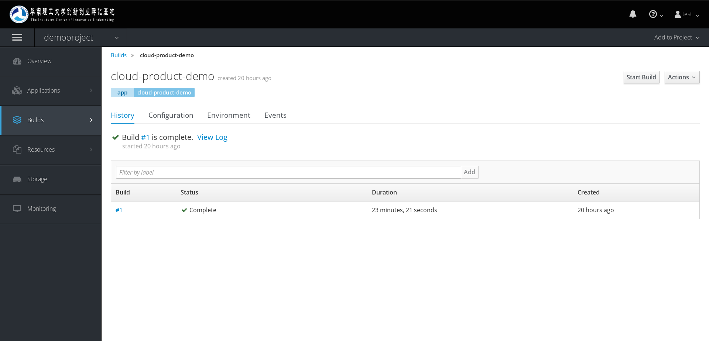
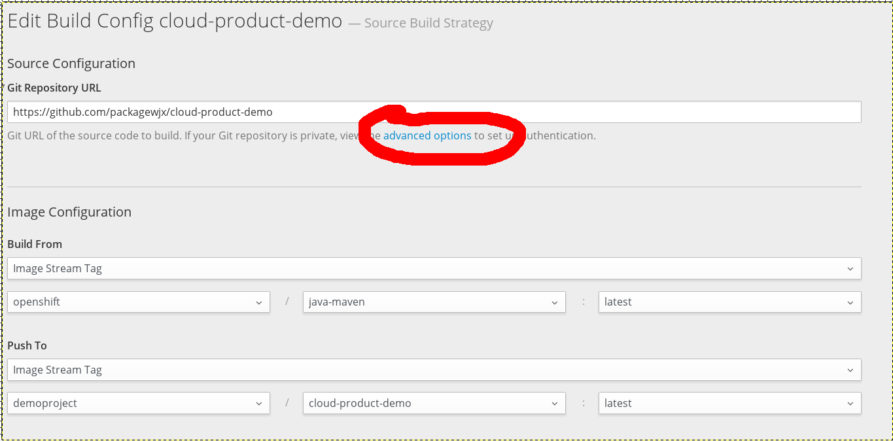
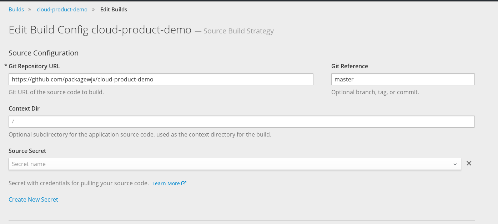
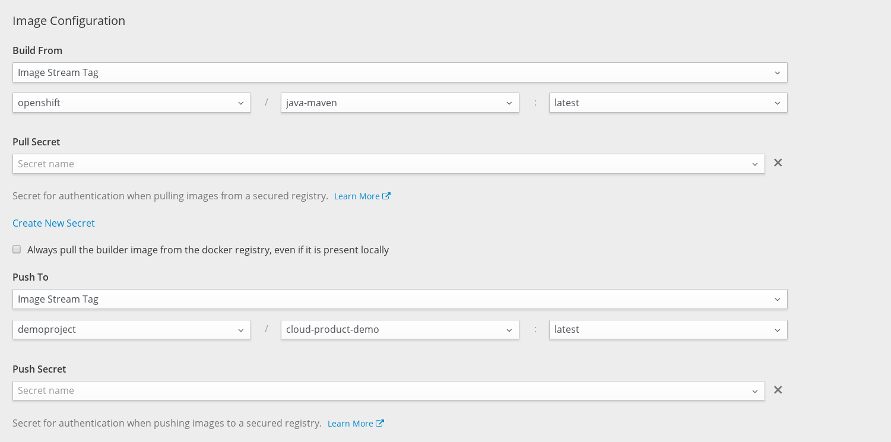
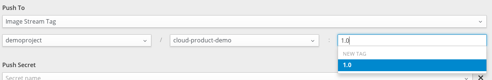

# 构建不同版本的镜像

要实现灰度发布、版本回退等的功能，我们必须构建不同版本的镜像，给镜像打上不同的标签即可。

首先，如果没有一个已经部署的项目，则先按照项目部署的流程，部署一个项目，以创建好BuildConfig，也可以使用命令行工具oc直接创建BuildConfig。

接着，我们进入到BuildConfig当中，如下图。

我们需要修改buildconfig的设置，单击右上角的Action菜单，选择Edit菜单项，进入设置页。如下图

如果我们需要根据tag构建精细哪个，则单击上图中的advanced options，打开进阶选项。

然后会显示出如下图的设置选项。

我们可以在Git Reference中，输入标签名、Commit的SHA值，或者分支名，输入分支名的话，会使用分支中最新的Commit来构建。

选择好代码的版本以后，我们往下，在Image Configuration设置中，看到有一个Push To的选项，如图的下半部分所示。

那么，我们要把镜像默认的latest的标签，改为我们设置的镜像版本号，可以与代码版本号一样。要注意的是，输入完版本号之后，下拉菜单会显示一个与我们输入的文本一样的选项，我们需要单击那个选项，才能新建一个标签。如下图

我们需要单击下拉菜单的1.0，才可以。

完成之后，就可以单击最下方的Save按钮，这样就保存了我们的设置。但是此时不会开始构建，需要单击BuildConfig右上角的Start Build按钮，才会开始构建。

等待一段时间之后，构建完成，去看导航菜单Build菜单的Image页，就能看到我们的镜像，看看有没有这个新的镜像标签吧。

然后就成功的构建出了指定版本的镜像了。每当新版出来时，再次设置一次，就能构建新版的镜像。
