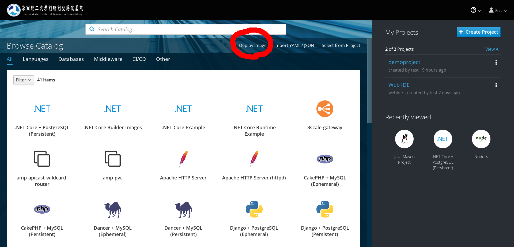
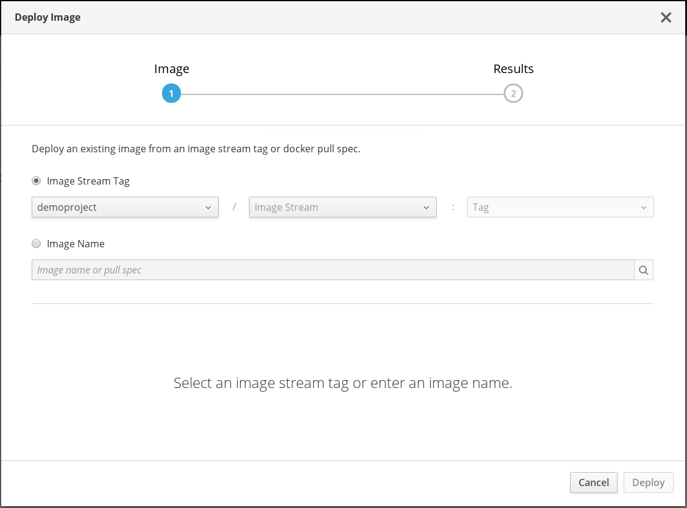

# 部署镜像到项目

首先，选择主页中间，目录浏览器右上角或者项目主页右上角的Add to Project菜单下的Deploy Image选项。如下图位置




然后，会弹出对话框，我们有两个选择，如下图所示。



我们可以选择我们项目的已经构建好的镜像流，只需要选择项目、镜像流名称以及需要的标签即可。

我们也可以选择部署Docker仓库的镜像，先选择Image Name单选框，然后输入我们需要的镜像名，镜像名的格式如下

```
[<仓库地址>:]<用户id>/<镜像名>[:<镜像标签>]
```

其中仓库地址默认为`docker.io`，如果镜像在另外一个地方，如私有镜像库，则需要输入这个地址。用户id和镜像名必须，如centos/httpd-24-centos7，镜像标签默认为`latest`。部分镜像没有用户id，如官方镜像。

比如我部署一个mysql镜像，如下图。


就能够部署一个mysql服务到我们的项目了。使用方法参照镜像制作方的说明，设置一些环境变量或者参数什么的即可。在部署页面可以设环境变量。

然后就完成了！你成功部署了一个镜像到项目中了。
