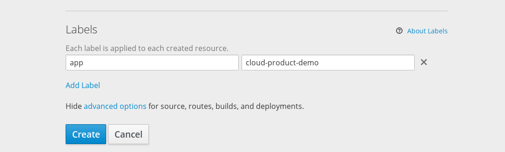
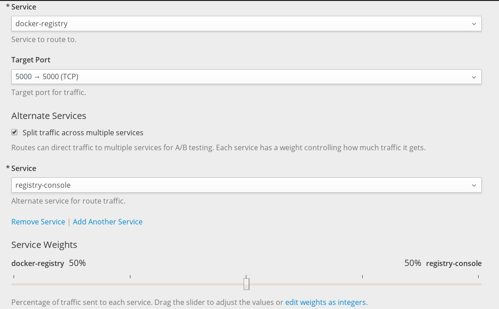

# 灰度发布

说明书中说的是命令行下的灰度发布。这里，我说明如何在网页客户端中使用灰度发布。灰度发布有两种方式，通过Service，和Route。

## 通过Service进行灰度发布

首先我们要有一个Service，进行配置，我们可以使用原有的Service，或者是通过命令行新建一个Service，目前暂不支持在网页客户端新建Service。

为了能够同时访问到不同版本的服务，我们需要让Service组件选择到不同版本的Pod。为做到这点，我们需要指定Service的selector，让其选择不同版本的pod共同有的标签。

单击Service详情页右上角的Actions，单击Edit YAML菜单项，我们修改Service的seletor，位置在`spec.selector`，在这里，我们需要输入选择器选择的键和值，这个值根据自己的需要来定。比如，若有一个服务提供hello的服务，那么我们可以设置一个选择器`svc=hello`，写成选择器时，如下所示

```yaml
spec:
  ...
  selector:
    svc: hello
```

那么这个Service会选择labels中有svc，且svc的值为hello的Pod。

然后，我们需要部署不同版本的Pod。我们可以[构建不同版本的镜像](build-and-tag-image.md)，然后部署，也可以部署自己已经构建好的镜像。我们需要设置Deployment中的labels，设置之后，Deployment部署的Pod将会有这个labels。我们在部署的进阶选项中，可以在最下面看到这个Labels，如下图所示。



部署完成后，原先的Service会选择到我们部署的Pod，并且不同版本的Pod都选择到。

我们可以调整Pod的副本数量，以调整不同版本容器的比重，如逐步调整新版本的容器的数量，逐步升级到最新版本。

以后，我们又有新版本的时候，只需要部署新版本，修改labels，然后再次调整数量，逐步更新版本。

## 基于Route进行灰度发布

一个Route可以设置调用多个Service，同时可以设置选择路径的时候各个Service的权重，以此，我们也可以进行灰度发布。

首先，我们需要部署多个不同版本的应用，推荐采用`应用名-版本号`的命名方式创建。容器云会自动帮助我们创建同名的服务。

然后，我们新建Route，单击Route概览右上角的`Create Route`即可，设置页中，配置Service的选项如下图所示



首先我们在Service中，选择某一个版本的Service，然后，选择`Split traffic across multiple serivces`，以让Route选择多个Service，然后我们选择第二个Service，在最下方，会出现`Service Weights`这个设置项，我们在这里设置不同的Service的比重。根据我们的需要设置即可。当Service有三个或三个以上时，将要输入一个正整数来确定各个Service的比重。

单击`Create`即可创建这个Service。注意，Route的选择只根据比重选择Service，而不是Pod，如果各个Service的Pod数量不相同，那么实际选择到不同版本的比重，与Route的比重不相同。
