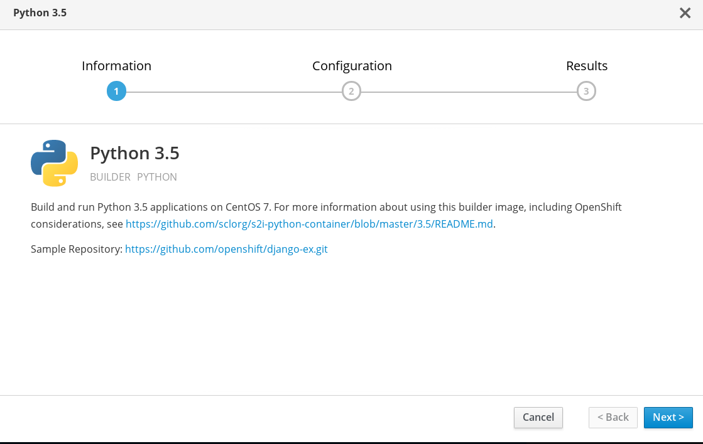
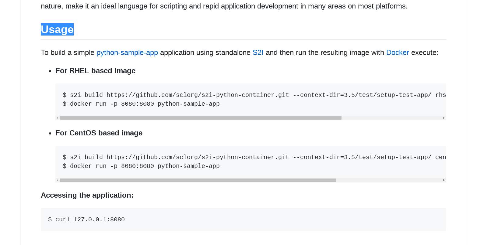
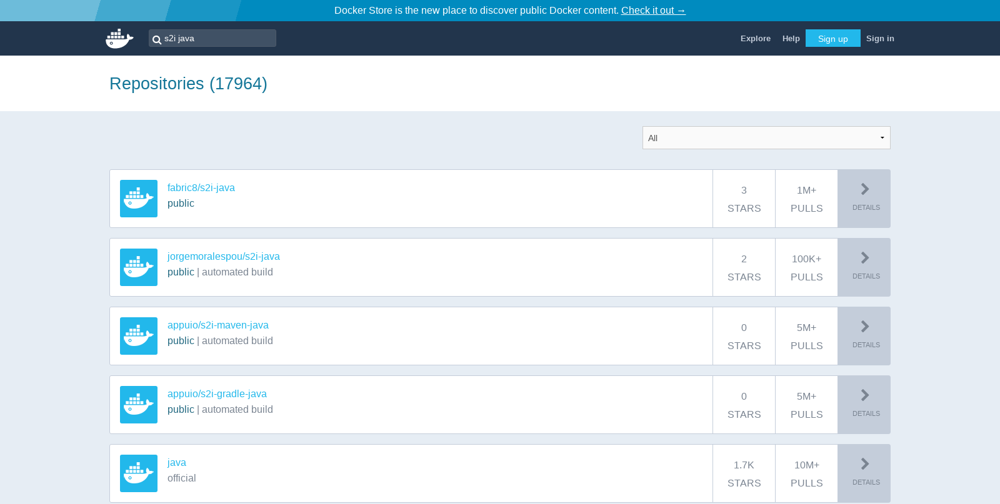

# 从源代码到镜像

我们可以使用专门的构建镜像，以及Openshift提供的S2I（Source To Image）工具，把我们现有的源代码，直接构建成能执行的镜像。

首先我们需要准备一个专门的构建工具，在[这个页面](https://github.com/openshift/source-to-image/releases)下，寻找最新稳定版的即可，支持linux，mac和windows。下载之后，解压得到一个s2i二进制文件，我们需要使用命令行调用它。

然后，我们需要找到我们的构建镜像。寻找构建镜像有一个方法，我们系统主页的镜像浏览器中的编程语言，或者Apache的构建镜像，都有说明，说明中包含了该镜像的代码库的地址，比如下图中python的，就有一个README的链接，其实就是该构建镜像的定义文件的库。



那么点进去，一般都有怎么使用这个构建镜像的方法，比如刚才的python。




就告诉了我们如何用s2i工具，构建这个镜像。

如果系统中没有你需要的构建镜像的话，我们可以到[Docker Hub](https://hub.docker.com)上找，一般构建镜像都会有关键字s2i，比如下面这些java的构建镜像。



查看一下说明，选择我们需要的镜像，记一下名字就好。

然后，我们使用这个命令，来构建一个我们应用的镜像。

```
s2i build <源代码文件夹路径> <构建镜像名> <应用程序镜像名>
```

源代码文件夹路径就输入源代码根目录的路径，或者是需要被构建的代码的路径。构建镜像名，填入我们选择的构建镜像，如上图中的appuio/s2i-maven-java。镜像名遵循docker镜像名的格式。然后应用程序镜像名则是我们新构建出来的应用程序的镜像名称，也遵循docker的镜像名格式。

构建完成之后，就可以使用`docker images`命令，查看我们已经构建好的镜像。

构建镜像都有各自的使用说明，如s2i-java-maven这个镜像，要求源代码根目录有一个pom文件，这样构建镜像会自动读取该pom文件并构建java代码。

如果没有找到自己需要的构建镜像，可以去查看[构建一个构建镜像](build-a-builder-image.mdbuild-a-builder-image.md)，然后再按刚才的内容进行构建。
