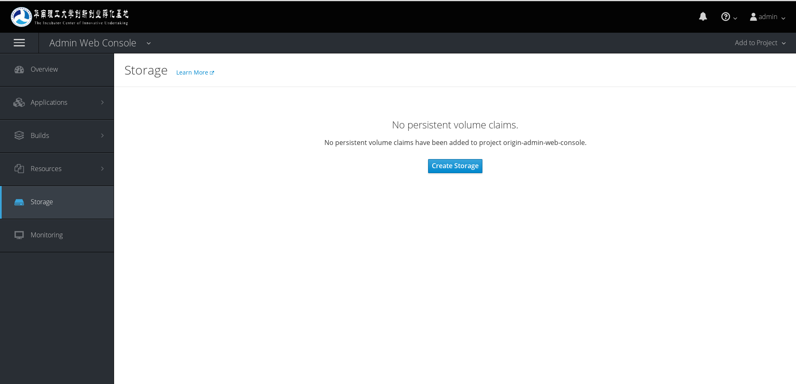
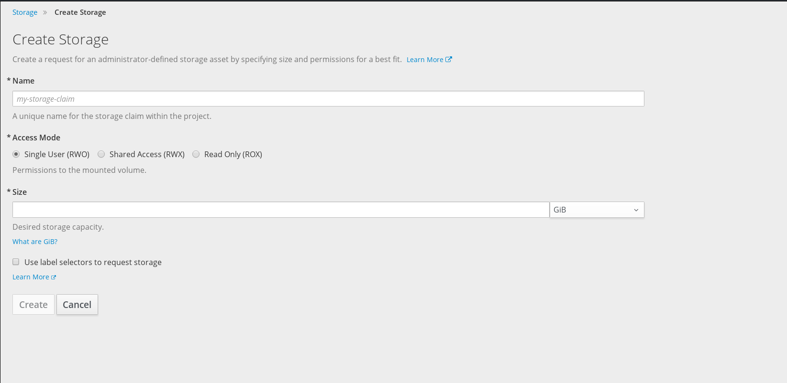
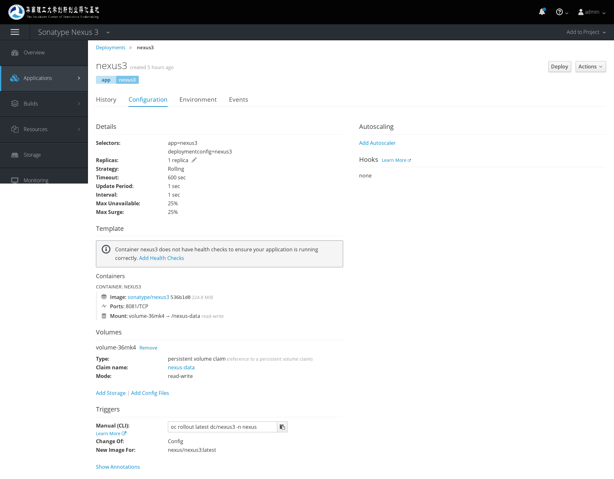
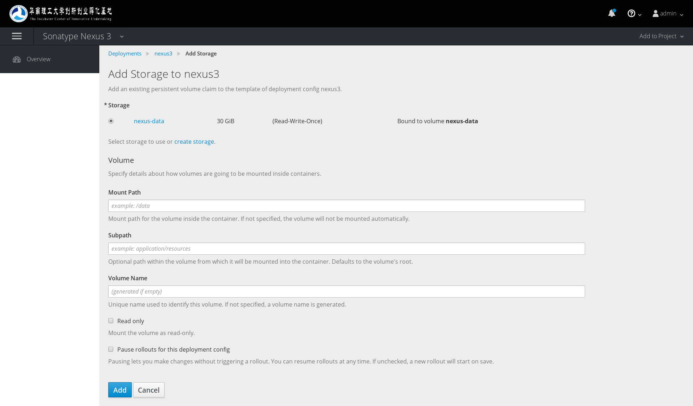
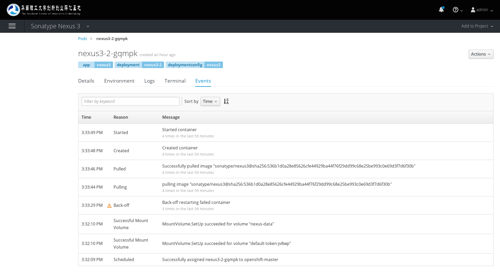

# 如何使用持久卷

容器云中运行的容器，默认都是挂载类型为emptyDir的卷，在Pod结束以后，该卷的内容就会消失。

如果想要持久化数据，就需要挂载持久卷。普通用户创建一个持久卷时，实际上创建的是一个持久卷的申请，系统内的名称为`PersistentVolumesClaims`。当管理员查看这个申请没有问题的时候，就会创建相应的持久卷给用户使用。创建持久卷完毕后，系统会自动将该申请绑定到该持久卷中。

## 创建持久卷申请

当我们需要持久卷时，进入到项目当中，在左边的一级导航菜单中，有一项是`Storage`。打开后，如图所示。

如果有持久卷，页面右上角是创建持久卷的按钮。

我们单击`Create Storage`创建持久卷。

然后出现创建持久卷申请的页面，如下图

名称中输入我们自定义的名字。Access Mode是指定该持久卷的挂载选项，分别是
- Single User(RWO) 指仅能被一个节点（非容器）挂载。
- Shared Access(RWX) 多个节点能够同时挂载并读取写入
- Read Only(ROX) 多个节点都能够读取，但是不能写入

Size中指定我们需要的大小，单位GiB=1024MiB

然后创建即可。

创建完后，需要找[管理员](mailto:wu812730157@gmail.com)申请一个持久卷。

### 为什么这么麻烦需要找管理员？

其实容器云平台支持自动的分配，但是需要使用分布式文件系统如GlusterFS或者Amazon、Google的存储服务。当前暂未使用这些，用的是NFS，因此需要管理员手动分配创建NFS卷，才能够使用持久卷。

将来部署好分布式文件系统后，就能够自动分配。但是，为防止滥用系统资源，预计将会给所有项目设置最大的存储空间限制，有需要较大的空间的，还是联系管理员申请。

### 可以使用用户自己的存储卷吗？

完全可以。当前的云服务提供商，比如腾讯云，提供了基于NFS的存储服务，购买了一个NFS卷之后，如果需要在我们这里创建该持久卷给你们使用，请提供NFS服务器的地址以及对应的文件夹路径。我们将会创建一个持久卷，并设置一个标签，为`project=<用户项目名>`。创建申请的时候，设置`Use label selectors to request storage`，并设置刚才的那个标签，就能选择到你自己创建的持久卷。

容器云平台设计成支持下面的所有存储：

- NFS
- HostPath (single node testing only)
- GlusterFS
- Ceph RBD
- OpenStack Cinder
- AWS Elastic Block Store (EBS)
- GCE Persistent Disk
- iSCSI
- Fibre Channel

## 删除emptyDir持久卷

如果我们挂载的目录，原本已经有一个emptyDir类型的卷挂载了，我们无法直接为它添加这个持久卷，需要先删除该emptyDir的卷。

在DeploymentConfig页中，进入到Configuration标签页，如下图

那么我们看到Volumes中，有持久卷，我们可以把Type为emptyDir的Remove掉即可。（没有合适的例子，图中没有emptydir的卷）

## 添加Persistent Volume Claim类型的持久卷

我们单击图中的Add Storage或者右上角Actions菜单下的Add Storage即可看到这个页面。

Storage中选择我们的申请好的持久卷。Mount Path则是输入我们容器中需要持久化的目录。SubPath的用处是，如果我们挂载的是我们申请的持久卷的其中一个目录到Mount Path中，则填入该目录的名称。如我申请的持久卷位置在`/exports`，但是我不想把整个`/exports`挂载上去，因为有其他的容器在使用，我在该目录下就可以创建一个名为`share1`的文件夹，那么我实际挂载到Mount Path的是`/exports/share1`。如果不设置Sub Path，则默认挂载根目录。Volume Name可以填入我们喜欢的名字，也可以空出来。其余选项较易懂不再解释。

然后重新启动容器，如果没有问题，就会挂载成功。挂载的日志，请查看被创建出来的那个Pod的Event选项卡，如果挂载成功，会有提示，如下图中的`MountVolume.Setup succeeded`。

