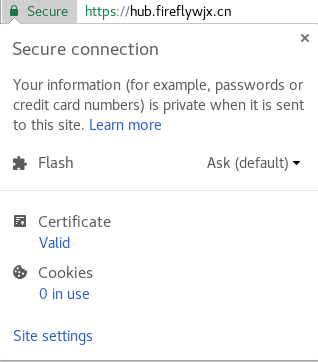

# 使用云平台私有镜像库

## 信任私有镜像库的证书

我们的私有镜像库使用加密连接，证书是由自建CA签发的自签发证书(self-signed certificate)，我们需要信任该CA的证书后，才可以继续。

### 获取自建CA证书

我们可以使用openssl或者浏览器，获取自建CA的证书，下面以Chrome（版本64）为例。其他浏览器请自行查找方法，得到的结果应该跟本例的相同。

首先使用浏览器进入网站<https://hub.fireflywjx.cn>。若未信任，浏览器会弹出不安全的提示页，我们可以不用管。我们单击左上角的地址左边的Secure或者Insecure按钮，会弹出站点的信息。如下图，我的电脑已经信任该证书，因此显示Secure。



看到图中有个Certificate项，单击该Valid（未信任时显示Invalid），弹出证书浏览器。如下图


单击详情页。我们需要选择Certificate Hierarchy最顶部的证书，该证书就是CA的证书。然后单击右下角的Export按钮，如下图所示。


选择合适的地点放置证书，证书格式为`Base64-encoded ASCII, single certificate`，把文件命名为ca.crt。

我们获取到的证书，以文本方式打开文件后，应该为下面这样的格式

```
-----BEGIN CERTIFICATE-----
<证书加密内容>
-----END CERTIFICATE-----
```

### 信任CA证书

获取了CA证书以后，我们需要让docker信任该仓库提供的CA。我们要在docker的信任证书文件夹内建立一个文件夹。信任证书文件夹路径，Windows的在`C:\ProgramData\docker\certs.d`，Linux在`/etc/docker/certs.d`。该文件夹下，创建一个目录，名为`hub.fireflywjx.cn`，即为我们的仓库地址。然后，放置`ca.crt`文件到该目录下，注意文件后缀名必须为`.crt`，否则会被认为时客户端证书而不是服务端CA证书。

## 登录

我们需要使用我们在云平台的帐号，登录到docker仓库中。

### 获取登录令牌

首先，我们需要获取我们当前登录帐号的登录令牌，有两种方式获取

#### 获取令牌方式一

在容器云主页的右上角，有一个用户菜单，如下


我们单击我们的用户名（图中的admin），有一项是copy login command，单击之后，会复制一条命令行登录容器云的命令，像下面这样的

```
oc login https://fireflywjx.cn:8443 --token=<令牌值>
```

令牌值是我们需要的令牌。

#### 获取令牌方式二

我们在命令行使用`oc login`登录以后，可以使用`oc whoami -t`获取登录令牌。如下所示

```bash
$ oc login fireflywjx.cn:8443
Authentication required for https://fireflywjx.cn:8443 (openshift)
Username: admin
Password:
Login successful.

You have access to the following projects and can switch between them with 'oc project <projectname>':

  ...
  * default

Using project "default".
$ oc whoami -t
<令牌值>
```

该输出就是我们需要的令牌值。

### docker登录

使用下面这条命令来登录到该私有仓库

```
docker login -u <云平台用户名> -p <令牌值> hub.fireflywjx.cn
```

## 使用私有仓库

私有仓库内，镜像都安放在以项目名（非显示名）命名的名称空间下。如我有一个项目，叫demo，那么我的名为demo-app，标签为latest的镜像的完整名称就是`hub.fireflywjx.cn/demo/demo-app:latest`。我们推送或者拉取的时候，都需要用这个完整的名称。

### 推送镜像

首先需要像上面那样命名你的镜像。名称空间必须为其中一个项目名，否则会报错。

然后使用`docker push <镜像名>`即可。

### 拉取镜像

直接使用`docker pull <镜像名>`即可。
