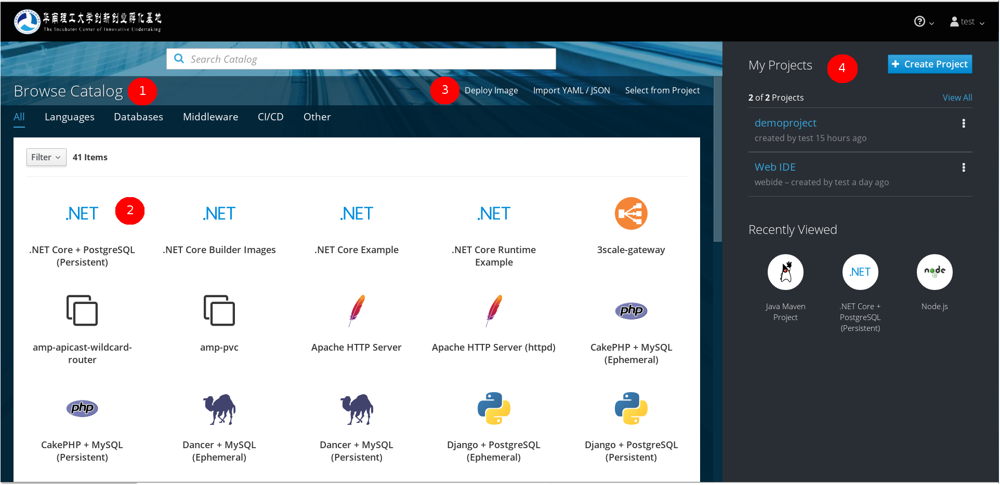
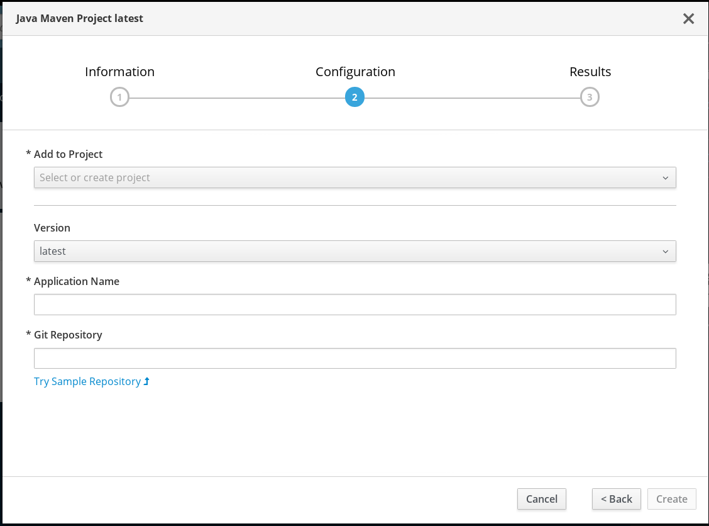

# 开发人员用户界面说明

## 主页

1. 模板、构建镜像流浏览器：模板是一些只需要用户填入模板参数，就能够部署一个应用的方便的工具。构建镜像流则是用于构建用户提供的git仓库的代码的，一般以语言命名的为构建镜像流。下方的一行按钮是筛选按钮，筛选2处，显示的内容。
2. 单击需要的模板，会弹出具体的设置对话框。有两种，一是从镜像流构建代码对话框，一是部署模板应用对话框。
3. 除了从目录中选择模板和构建镜像流来构建代码，还可以在此处选择其他三种构建方式，分别是
  - Deploy Image：用于
  - Import YAML/JSON
  - Select from Project
4. 项目浏览器：用户自己的项目就显示在这里。单击项目名进入项目主页。单击右边的三个点的按钮，弹出编辑菜单，分别可以查看项目成员，设置项目属性，以及删除项目。

## 从镜像流构建代码对话框

主要在第二页输入参数。

Add to Project中，选择我们需要部署到的项目。

Version选择本构建镜像的版本，一般这个版本与语言的版本一致。根据自己项目的需要进行构建。

## 从镜像流构建代码，进阶设置页

## 部署模板应用对话框

## 项目主页
